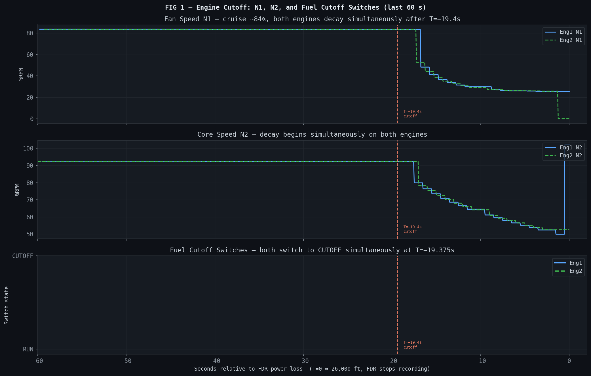
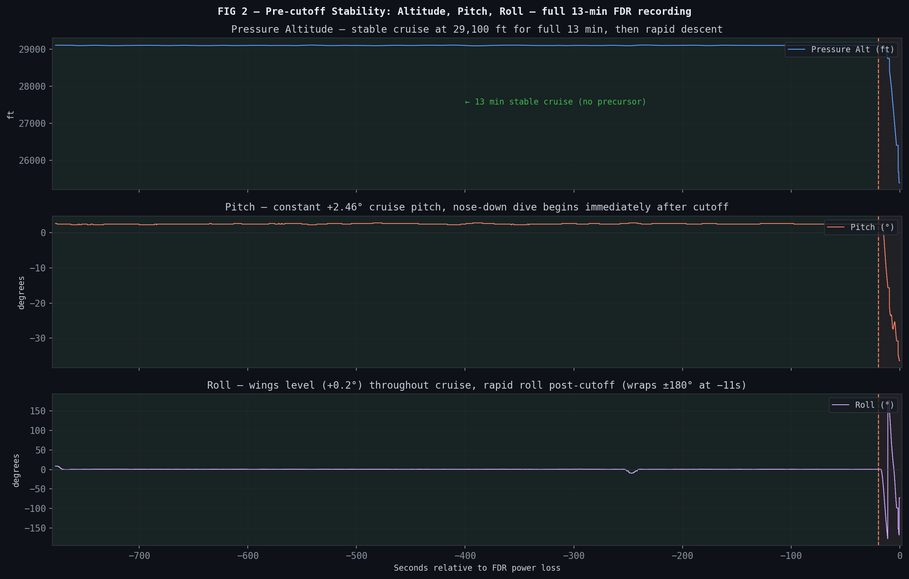
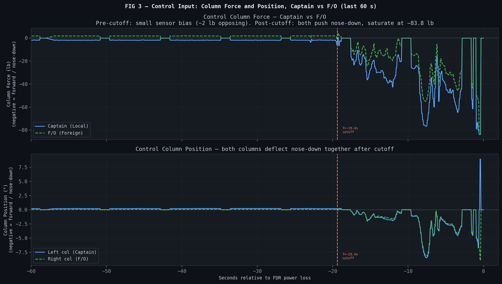
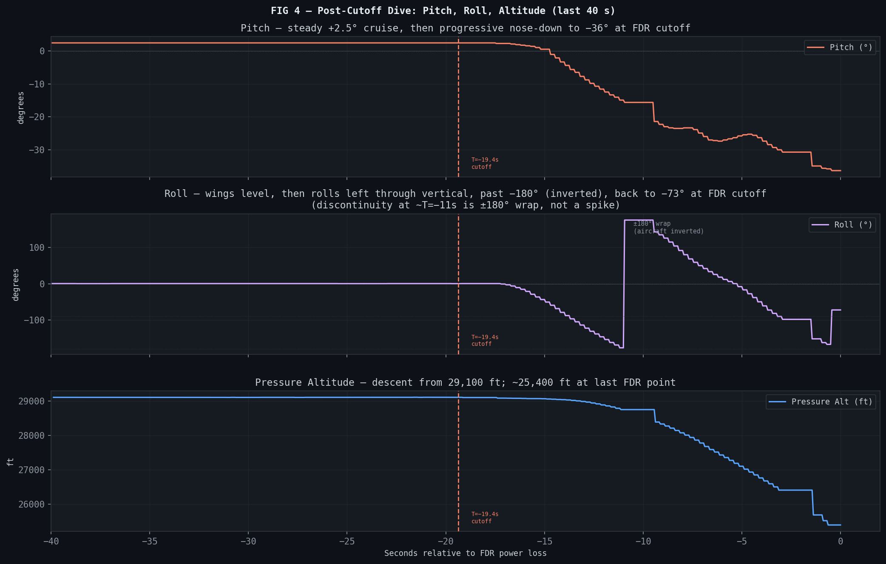
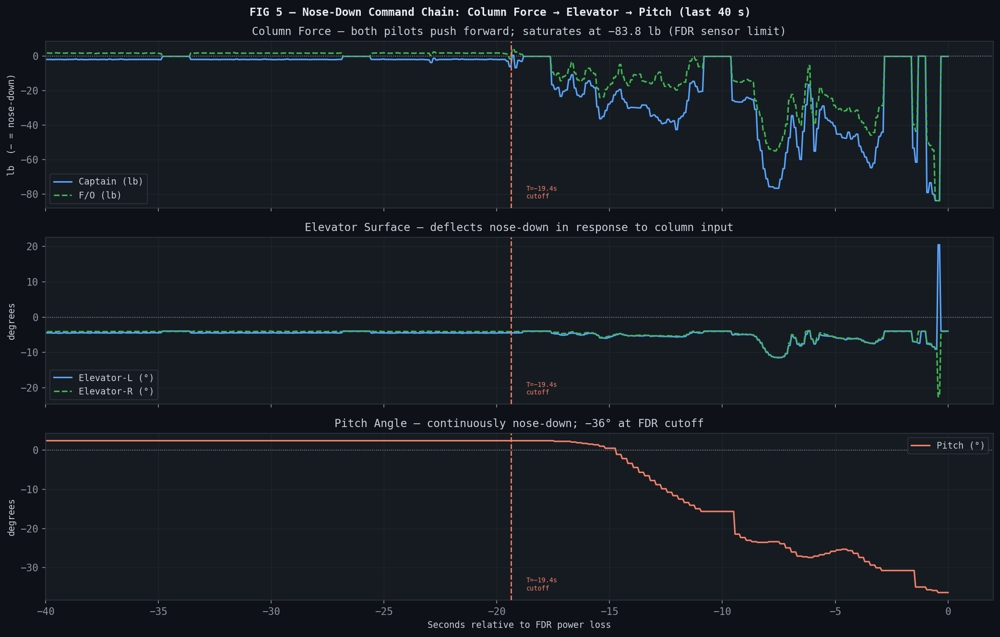
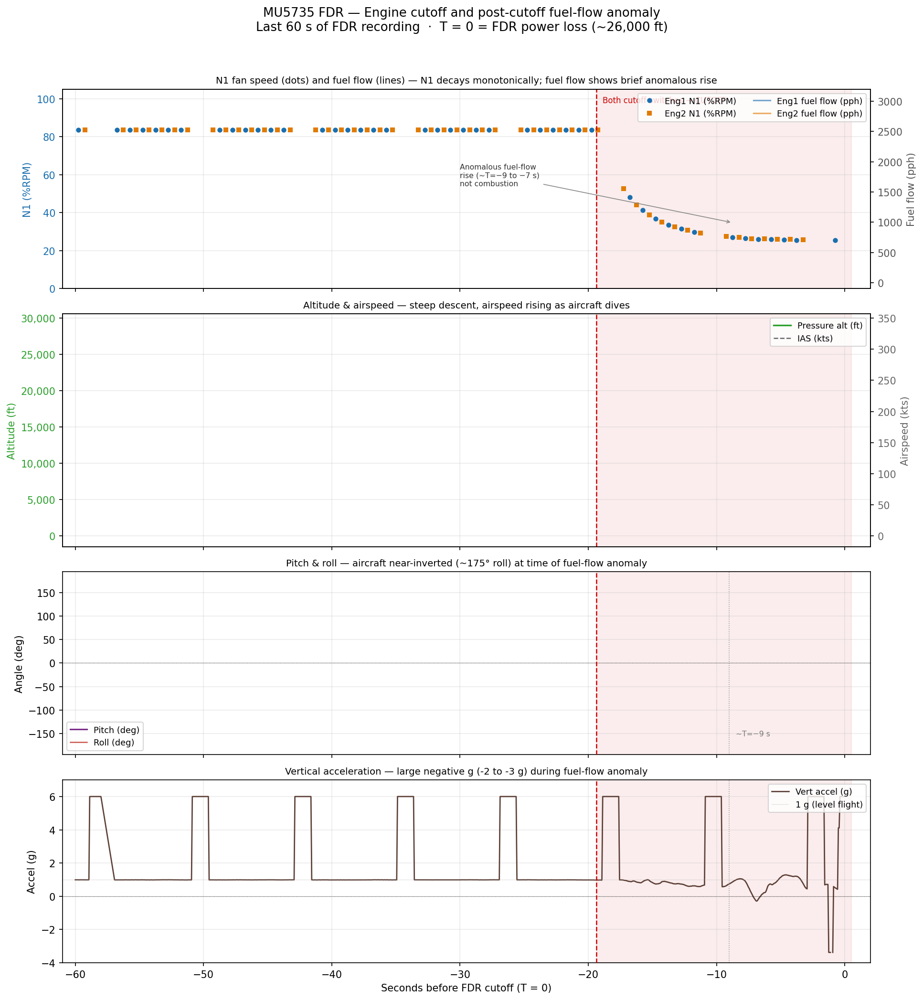

# Analysis: NTSB DCA22WA102 — FOIA Release Records

## Overview

This document analyses the content of the FOIA Release Records for NTSB case DCA22WA102 (China Eastern Airlines Flight MU5735, March 21, 2022), with specific focus on:

1. The **"filed differences"** referenced in PDF(8), pages 61–63
2. The **FOIA request context** — when and why the documents were released
3. The **recorder recovery** challenges and outcomes (PDF(1))
4. What **the recorders show**

---

## 1. The "Filed Differences" — PDF(8), Pages 61–63

### Context: An Email Chain, March 20–21, 2024

Pages 61–63 of `FOIA Release Records - DCA22WA102 (8).pdf` contain a critical email exchange between NTSB and CAAC/China Eastern officials, dated precisely **two years after the accident** (March 20–21, 2024).

**Parties:**
- **Sathya S. Silva, Ph.D.** — Senior Aviation Accident Investigator / Investigator in Charge (IIC), Air Carrier and Space Investigations Division, NTSB (Washington DC)
- **Capt. Lin** (林航 / Hang Lin) — Director, Accident Investigation Division, CAAC; served as IIC on the CAAC side of the data recovery group
- **朱涛 (Zhu Tao)** — CAAC (CC'd)
- **李勇 (Li Yong)** — CAAC (CC'd)
- Internal NTSB recipients: **Frank Hilldrup**, **Lorenda Ward**

### What the "Filed Differences" Are

Sathya Silva's email (pages 62–63) explicitly states:

> *"I do want to ensure that the CAAC is aware of our filed differences from Annex 13. One of these differences is to **5.26** and **6.2** of the Annex..."*

**ICAO Annex 13, §5.26** — *Accredited representatives and their advisers:*
> a) shall provide the State conducting the investigation with all relevant information available to them; and  
> b) shall **not divulge** information on the progress and the findings of the investigation **without the express consent** of the State conducting the investigation.

**ICAO Annex 13, §6.2** — *States shall not circulate, publish or give access to a draft report or any part thereof, or any documents obtained during an investigation..., **without the express consent** of the State which conducted the investigation*, unless such reports or documents have already been published or released by that latter State.

**In plain terms**: Under standard ICAO Annex 13 protocol, the NTSB (as an accredited representative) would normally need CAAC's consent before releasing any investigation records. However, the NTSB has formally filed differences with both of these sections.

The reason is a **conflict with US federal statute**, specifically **49 USC §1114(e)(1)**:

> *"(1) In general.—Notwithstanding any other provision of law, neither the Board, nor any agency receiving information from the Board, shall disclose records or information relating to its participation in foreign aircraft accident investigations; **except that**—*  
> *(A) the Board shall release records pertaining to such an investigation when the country conducting the investigation **issues its final report or 2 years following the date of the accident, whichever occurs first**; and*  
> *(B) the Board may disclose records and information when authorized to do so by the country conducting the investigation."*

The NTSB's filed differences are a formal declaration that US domestic law overrides the ICAO Annex 13 consent requirements in cases where the 2-year clock has run or the final report has been published.

### Why March 2024?

Silva's email (page 63) makes the situation explicit:

> *"Therefore, we are now approaching (2 years from date of accident) the law detailed in subpart A of the federal statute since **a final report has yet to be issued**. What this means is that beginning tomorrow, we may begin to receive FOIA (Freedom of Information Act) requests for data on this accident that we will be required to respond to within a given time frame."*

> *"The most sensitive data that could potentially be requested would be the **flight data** given the work that was conducted in our labs."*

> *"I currently do not have any requests for information, however **we do anticipate requests coming in soon from the media**. I will notify you if/when I receive any requests for information."*

This email was written on or around **March 20, 2024** — one day before the 2-year mark. The CAAC had **not yet issued its final report** on MU5735. Under 49 USC §1114, the 2-year clock therefore forced the NTSB's hand.

### Capt. Lin's Response (Page 61)

On March 21, 2024, Capt. Lin responded:

> *"Dear Sathya, Thank you for your email and detailed explanation. [b(5) redacted] As you suggested, we do want to have the opportunity to discuss with you via a virtual meeting. [b(5) redacted]  
> Best. Capt. Lin"*

The b(5) redactions indicate content protected by the deliberative process privilege (inter/intra-agency discussion). The exchange shows CAAC engaging diplomatically rather than objecting outright.

---

## 2. FOIA Request — When and By Whom

### Timing

The FOIA release was triggered by the **2-year statutory deadline under 49 USC §1114**: March 21, 2024 (two years after the March 21, 2022 accident). CAAC had not yet issued its final investigation report by that date.

As of March 20, 2024 (the date of Sathya Silva's email to Capt. Lin), **no FOIA request had yet been received by the NTSB** — but media requests were anticipated.

### Requester Identity

The documents released in these 8 PDF volumes do not explicitly name the FOIA requester(s) on any visible cover sheet within the released files themselves.

According to reporting by *The Wall Street Journal* (archived at archive.ph/ysqJH), **the FOIA request was filed by a Chinese citizen** — making this an unusual case where a foreign national used the US Freedom of Information Act to obtain investigation records that the Chinese government had not publicly released. This is legally possible: the US FOIA does not restrict requests to US citizens or residents.

> **Note**: This identification of the requester comes from press reporting and is **not independently verified** within the released NTSB documents themselves. The NTSB documents only confirm the *timing* trigger (2-year statutory clock). What is clear from the documents is that Silva anticipated media requests, and a May 2022 email references a "Wall Street Journal article" showing the WSJ was covering the story closely.

---

## 3. Recorder Recovery — PDF(1): NTSB Combined Download Report (July 1, 2022)

**Report Author**: Charles Cates, Mechanical Engineer/Recorder Specialist, NTSB  
**Subject Matter Experts**: Joseph Gregor, Ph.D. (Electrical Engineer/Recorder Specialist, NTSB); R. Greg Smith (Branch Chief, Vehicle Recorders Division, NTSB)  
**Specialist**: W. Deven Chen (Electrical Engineer/Recorder Specialist, NTSB)  
**CAAC Group**: Xiangdong Wan (Team Leader), Hang Lin (IIC), Yu Zhang, Liling Yu, Xin Miao, Chun Wang

The NTSB Vehicle Recorder Division received memory modules from two recorders:

| Recorder | Manufacturer/Model | Part Number | Serial Number | Recovered |
|---|---|---|---|---|
| CVR | Honeywell HFR5-V | 980-6032-001 | CVR-04014 | March 23, 2022 |
| FDR | Honeywell HFR5-D | 980-4750-009 | FDR-02952 | March 27, 2022 |

---

### 3.1 CVR — Recovery Difficulties

**Initial damage:**  
The CVR Crash Survivable Memory Unit (CSMU) was heavily damaged by impact. The memory module's connector had extensive damage: solder pads providing electrical signal paths to data and address chips were bent or completely dislodged. The plastic connector housing itself was deformed — one edge raised above normal, pins recessed; the opposite edge crushed down. An additional anomaly was found: a capacitor had been lifted from the board and sealed over with conformal coating since manufacture (never electrically connected from new).

**CAAC's initial attempts (Beijing, before NTSB):**  
The CAAC opened the CSMU at their facilities in Beijing, removed protective RTV sealant, and made several download attempts using a surrogate chassis. The downloaded audio was **unintelligible** — stuttering, echoing, and digital noise throughout. The download file was provided to the NTSB in `.dlu` format on March 28, 2022.

**NTSB recovery process (March–April 2022):**

| Step | Method | Result |
|---|---|---|
| 1 | CAAC-provided `.dlu` decompressed with Playback32 | 4 wav files generated; audio **unintelligible** throughout |
| 2 | Microscopic inspection | Extensive connector damage catalogued; pins bent/separated |
| 3 | Pin repair with cyanoacrylate glue; modified flex recovery cable | Installed in NTSB HFR5-V golden chassis |
| 4 | Playback32 download | Failed to generate usable `.dlu` |
| 5 | DLDR engineering tool (direct chip-level read) | Generated chip images; Playback32 produced 4 wav files — **Poor to Fair** quality; digital artifacts consistent with data/address line damage |
| 6 | 2-D and 3-D X-ray imaging | No new damage found; adjusted recovery cable accordingly |
| 7 | Connector shell fully removed | Revealed additional hidden damage: more loose/removed pads/traces; ground planes loose at all-but-one attachment point |
| 8 | Pins re-shaped, Kapton tape insulation added, new connector shell installed | Pins re-mated to modified flex cable; re-installed in golden chassis |
| 9 | Final Playback32 + DLDR download | **Excellent quality** on all 4 channels; no connector errors |

**Final CVR outcome:**

| Channel | Content | Quality | Duration |
|---|---|---|---|
| 1 | Cockpit Observer Audio Panel | **Excellent** | ~120 min |
| 2 | First Officer Audio Panel | **Excellent** | ~120 min |
| 3 | Captain Audio Panel | **Excellent** | ~120 min |
| 4 | Cockpit Area Microphone (CAM) | **Excellent** | ~180 min |

A non-linear time drift between the CAM (wideband, 16 kHz) and crew channels (narrowband, 8 kHz) was identified and corrected. Minor packet dropout artefacts were present in the narrowband channels, possibly related to the pre-existing (manufacturing defect) capacitor damage.

> ⚠️ **NTSB claims it retained no copy of the CVR audio — a claim that is technically implausible given the recovery workflow.**
>
> The NTSB's own report states it *"did not retain any of the files provided to the CAAC delegation other than the photographs, scans, and microscopic images."* This has been separately confirmed in press reporting (CNN, May 2026): US investigators extracted all four channels at Excellent quality and provided the audio to CAAC, stating they kept no copy of the audio files.
>
> **Why this claim strains credibility:**
> The CVR recovery involved a multi-step forensic process that inherently requires intermediate digital copies:
> 1. Raw chip-off binary read from the CSMU flash memory chips → must be written to a working file before any processing
> 2. Frame sync and decoding of the CSMU binary format → requires a decoded intermediate file
> 3. Separate processing of CAM (16 kHz wideband) and crew channels (8 kHz narrowband) → separate decoded audio streams
> 4. Non-linear time drift correction between CAM and crew channels → requires read/write of corrected audio
> 5. Quality verification playback → requires a locally readable audio file
> 6. Final export of WAV files for delivery to CAAC
>
> Each of these steps produces at least one intermediate file on NTSB equipment. A forensic audio extraction of this complexity, conducted over multiple days at the NTSB lab, does not produce a single output file with no traces. The assertion that zero copies were retained — not even a working backup, a QC copy, or a verification file — is technically extraordinary.
>
> Whether this reflects a deliberate policy decision, a legal interpretation of ICAO Annex 13 obligations, or an incomplete description of what was retained, the practical effect is the same: **the only recorder that captured the full final sequence of MU5735 is now held exclusively by the government of China, with no independently verifiable copy.**

---

### 3.2 FDR — Recovery Difficulties

**Initial damage:**  
The FDR CSMU was heavily damaged by impact. Unlike the CVR, the FDR board showed no significant heat exposure (temperature dot negative). The CAAC attempted one download with a surrogate FDR chassis: **unsuccessful**.

**NTSB recovery process (April 2022):**

The FDR CCA was presented to the NTSB on **April 4, 2022**.

| Step | Method | Result |
|---|---|---|
| 1 | Initial Playback32 download attempt | **Failed** |
| 2 | DLDR chip-level download (multiple attempts) | Generated mostly all-zeros for each chip image — no data |
| 3 | Microscopic inspection (RTV removed) | **Critical finding**: FLASH chip **U2** has crack extending from top edge through center of chip packaging, penetrating to conformal coating surface. Epoxy bonds on multiple chips (U1&U2, U5&U7, U51&U52) show widespread cracking/separation |
| 4 | X-ray inspection | No additional hidden damage beyond visual findings |
| 5 | Decision: "Chip-off" recovery — physically remove chips from PCB | Process validated on known-good surrogate module first |
| 6 | Chip removal via Finetech FinePlacer (controlled heat/suction) | Chips U1, U3, U4, U5, U6: removed successfully; U2 removed but found to have **network of cracks on underside of silicon die** |
| 7 | Xeltek SP-6100 chip reader | U1, U3, U4, U5, U6: **data recovered**; **U2: unreadable** — pin-check errors, shorted pins, silicon die destroyed |
| 8 | CT scan and X-ray of U2 | Confirmed internal die damage; cracks penetrate the silicon die; data from U2 **unrecoverable** |
| 9 | Dummy "all-FF" file substituted for U2 | FDR DLU file created via Honeywell CHIPS utility |
| 10 | Data framing in NTSB CIDER software | Data reconstructed; timing corrupted by U2 substitution (4-second padding errors due to subframe sync loss) |
| 11 | Manual timing correction at word-boundary level | Timing corrected for **final 12 minutes** only |

**Data gaps from missing chip U2:**

The HFR5-D writes flight data striped across 6 chips. At 512 data words/second, each chip write = ~1.3 seconds. The missing U2 data creates a **~1.3-second gap for every ~6.5 seconds of valid data** throughout the recording.

**Final FDR outcome:**

- ~25 hours of raw recorded data present (minus U2 gaps throughout)
- **Only the final 12 minutes** were time-corrected to be aligned with CVR events
- Additionally, **portions of the previous landing and taxi** were corrected to assist parameter validation
- The tabular CSV files in this repository (`DCA22WA102-220414-AllValidated-*`) represent this corrected data, validated April 14, 2022

---

## 4. What the Recorders Show

### FDR — Key Finding

From the FDR Combined Download Report (page 22, lines 627–630):

> *"...looking for the reason that the engine N2 dropped below the generator cutoff speed, it was found that while **cruising at 29,000 ft**, the **fuel switches on both engines moved from the run position to the cutoff position**. Engine speeds decreased after the fuel switch movement."*

The FDR plots (Figures 11–13 in the report, covering the final 90 seconds of recording) show:

- **Figure 11 (Basic aircraft parameters)**: Altitude Press., Airspeed Comp., Lateral/Longitudinal/Vertical Acceleration, Pitch Angle, Roll Angle, Engine 1 & 2 Cutoff Switch positions
- **Figure 12 (Flight control positions)**: Elevator L & R, Control Column L & R, Control Wheel L & R positions, Altitude, Airspeed
- **Figure 13 (Control forces during upset)**: Control Column Pitch CWS forces (Local and Foreign), Pitch Angle, Control Wheel Roll CWS forces, Roll Angle — from onset of the upset through impact

The data from the final seconds of FDR recording shows the aircraft in a steep dive with pitch angles steeply negative and roll approaching extreme values. **Note**: the FDR stopped recording at approximately 26,000 ft when the generators went offline — these plots capture the initial dive onset, not the final terrain impact (see Section 6 for the power-loss explanation).

### CVR

All four audio channels were recovered at Excellent quality. The CVR content (the audio itself) was provided exclusively to CAAC and is not included in this FOIA release. The CVR would contain cockpit conversations and area microphone audio for the full ~120–180 minutes preceding the crash, including the accident sequence.

### Combined Interpretation

The FDR's finding of **both fuel cutoff switches moving to the CUTOFF position at cruise altitude** — with no preceding technical malfunction recorded — is the central factual finding of the recorder data. This finding, taken together with the CVR audio (withheld from public release), forms the core of the investigation into whether the event was deliberate.

The CAAC investigation was still open and had not published a final report as of March 2024 (two years post-accident), which was the direct trigger for this FOIA release.

---

## 5. Investigative Timeline Summary

| Date | Event |
|---|---|
| March 21, 2022 | Accident — MU5735 crashes near Wuzhou, China (0630 UTC) |
| March 23, 2022 | CVR CSMU recovered from wreckage |
| March 24–25, 2022 | Early NTSB–CAAC coordination on CVR transfer; Honeywell technical meeting |
| March 27, 2022 | FDR CSMU recovered from wreckage |
| March 28, 2022 | Data recovery group convened at NTSB; CVR module received |
| April 4, 2022 | FDR module received at NTSB |
| April 5–7, 2022 | NTSB team in China; virtual meetings with CAAC groups (Flight Operations, Airworthiness, Maintenance, ATC) |
| April 14, 2022 | FDR parameter validation completed (version 007); CSV exports created |
| May 18, 2022 | NTSB–CAAC email re: Wall Street Journal article coverage |
| July 1, 2022 | NTSB Combined CVR/FDR Download Report finalized |
| March 20, 2024 | NTSB (Sathya Silva) notifies CAAC (Capt. Lin/Hang Lin) of imminent 2-year FOIA trigger; no final CAAC report yet issued |
| March 21, 2024 | **2-year statutory deadline reached** (49 USC §1114); NTSB legally obligated to release records on FOIA request |
| 2024 (date TBD) | FOIA request(s) received; 8-volume release issued |

---

## 6. The `.upk` Files — NTSB "Unpacked" FDR Data

### What `.upk` Files Are

The three `.upk` files in this repository are **NTSB CIDER "unpacked" binary files** — a proprietary format output by the NTSB's internal FDR analysis software called **CIDER** (Custom Interactive Data Editing and Replay). They are referenced directly in the FDR Combined Download Report (PDF(1), page 23):

> *"All FDR unpacked binary files generated by the NTSB's CIDER FDR analysis software."*  
> *"Manually corrected unpacked binary files that correctly time-aligned the final 12 minutes of recorded data."*

CIDER processes the raw `.dlu` files produced by Honeywell's Playback32 utility and outputs decoded, time-tagged, engineering-unit parameter data in this binary format. The NTSB does not publish the CIDER file format specification; however the files can in principle be reverse-engineered for analysis.

### What Each File Contains

| File | Size | Contents |
|---|---|---|
| `DCA22WA102-Final12minutes.upk` | 4.1 MB | **Time-corrected** FDR data for the final ~12 minutes of the accident flight (MU5735). This is the analytically reliable portion — timing has been manually aligned to allow synchronisation with the CVR. |
| `Last2Flights(final).upk` | 9.4 MB | FDR data covering the **last two flights** recorded on the FDR: the accident flight (MU5735) and the preceding flight. Data outside the 12-minute window has ~1.3-second gaps every ~6.5 seconds due to missing chip U2, but is otherwise present. |
| `PreviousLanding+LastFlight_PartiallyCorrected(AsOf220414).upk` | 7.0 MB | Previous landing and accident flight with **partial timing correction** as of April 14, 2022 — a work-in-progress snapshot at the time of the FDR validation export. |

### Coverage: The FDR Did NOT Record Until Impact

This is a critical point that is easy to miss. From the NTSB Combined Download Report (PDF(1), page 23):

> *"The FDR data ended with the aircraft still in flight. The data stopped with the aircraft in a descent at approximately **26,000 ft**. It did not capture the remainder of the descent and final accident sequence. Investigating the reason for the premature end of the flight data it was found that while at cruise at 29,000 ft, **both engine N2 values decreased rapidly below the point at which the generators drop offline**. The FDR does not have a battery backup, so without power from the aircraft generators it will power down. This is different from the CVR, which does have a battery backup and **can continue recording for at least 10 minutes** after the loss of the aircraft generators."*

**In summary:**

| Recorder | Power source | Battery backup | Recording end |
|---|---|---|---|
| **FDR** (HFR5-D) | Aircraft AC generators (engines) | **No** | ~26,000 ft — when both N2s dropped below generator cutoff speed |
| **CVR** (HFR5-V) | Hot Battery Bus | **Yes** (≥10 min after generator loss) | Continued recording through the full descent and impact |

The sequence of events from the FDR data:
1. Aircraft cruising at 29,000 ft
2. Both fuel cutoff switches moved to CUTOFF position
3. Engine N2 speeds decreased rapidly
4. When N2 dropped below generator cutoff speed → **both AC generators went offline**
5. **FDR lost power and stopped recording** — aircraft at approximately 26,000 ft
6. CVR continued recording on battery backup for at least 10 more minutes — capturing the full remaining dive and impact sequence

The `DCA22WA102-Final12minutes.upk` and the CSV files therefore cover the **final 12–13 minutes from cruise through the initial dive to ~26,000 ft**, not to impact. The final descent, loss of control, and terrain impact are recorded only on the CVR — which was provided exclusively to the CAAC.

> **This vindicates the user's recollection**: the FDR did indeed stop recording ~10 minutes before impact due to power loss. The CVR (battery-backed) is the recorder that captured the rest of the sequence.

### How to Read `.upk` Files

The `.upk` format is proprietary to NTSB/CIDER software. Options for reading them:

1. **NTSB CIDER software** — Not publicly available; requires NTSB/investigation access
2. **Reverse engineering** — The binary structure could potentially be decoded given the known parameter list (see [`observables.md`](observables.md)) and the ARINC 717 data stream structure
3. **Cross-reference with CSV** — The CSV files (`DCA22WA102-220414-AllValidated-*`) were exported from these same UPK/CIDER files and are fully readable; for most analytical purposes the CSVs are sufficient

---

## 7. Notes on Redactions

Throughout the FOIA release, two categories of redactions are applied per the Freedom of Information Act exemptions:

- **b(5)** — Deliberative process privilege: Internal government communications about investigative decisions, inter-agency negotiations, or pre-decisional analysis
- **b(6)** — Personal privacy: Names, phone numbers, email addresses, and other personal identifiers of government employees and private individuals

The substantive findings of the FDR/CVR analysis are not redacted. The redacted content primarily covers: the specific meeting substance between NTSB and CAAC investigators, individual email addresses, and ongoing deliberative discussions about the investigation's direction.

---

## 8. FDR Data Analysis — Key Findings

*Based on direct analysis of `DCA22WA102-220414-AllValidated-TableResolution.csv`. All times are relative to T=0 = last recorded FDR data point (when the FDR lost power). The FDR covers approximately T=−778s to T=0. See `EDA_1.html` for interactive exploration.*

*A note on the Cutoff Switch parameter: the raw CSV shows CUTOFF→RUN→CUTOFF cycling every ~8 seconds throughout the entire flight. This is the ARINC 429 sentinel artifact (see `data.md §Sentinel Values`), not real switch activity. The real final transition is identified as the last RUN→CUTOFF with no subsequent return to RUN.*

---

### 8.1 Engine Cutoff — Timing and Sequence

**Both fuel cutoff switches were moved to CUTOFF simultaneously at T=−19.375s.**

This is confirmed by the last RUN→CUTAV transition for both Eng1 and Eng2 Cutoff SW parameters at exactly the same timestamp, with no subsequent return to RUN. The switches were moved in unison — no sequential or independent action between the two engines.

N1 at the moment of cutoff was ~83.5% (normal cruise thrust). The decay is rapid:

| Time | Eng1 N1 | Eng2 N1 | Pitch | Roll |
|---|---|---|---|---|
| T=−19.4s | 83.5% | 83.5% | +2.5° | +0.2° |
| T=−16.8s | 48.3% | 52.8% | +2.3° | −3.0° |
| T=−15.8s | 41.4% | 44.0% | +1.6° | −21.3° |
| T=−14.8s | 36.8% | 38.8° | −0.2° | −50.8° |
| T=−13.8s | 33.6% | 35.1% | −4.4° | −88.2° |
| T=−12.9s | 31.5% | 32.6% | −8.8° | −123.1° |
| T=−11.9s | 29.9% | 30.8% | −12.5° | −154.5° |
| T=−8.8s  | 27.1% | 27.5% | −23.0° | +126.2° (past −180°) |
| T=−0.8s  | 25.6% | 25.6% | −35.9° | −167.9° |

By T=−18s N1 had already dropped to ~48%, the aircraft had begun rolling left. Roll rate was extremely rapid: from +0.2° to −154.5° in under 8 seconds (~20°/s average, peaking higher). By T=−8.8s the roll angle had passed through −180° and was reading positive again (past vertical).

**The FDR stopped recording at ~26,000 ft with the aircraft in a steep nose-down (~−36° pitch), near-inverted attitude (~−168° roll).**

---

### 8.2 Attitude Before Cutoff — No Disturbance

From T=−778s to T=−20s, pitch was a rock-steady +2.46° and roll was +0.18° to +0.35°. Altitude held at 29,095–29,112 ft. N1 held at 83.5–84.9% (normal cruise). There is no precursor turbulence, no altitude deviation, no control surface movement, and no autpilot disengagement in the FDR data prior to the cutoff event.

**The aircraft was in completely normal, stable, hands-off cruise for the entire 13 minutes of recorded data up to the moment of cutoff.**

---

### 8.3 Crew Control Inputs — Both Pilots, Same Direction

The FDR records column force independently for each seat:
- `Ctrl Col Force Pitch CWS Local` — Captain's column (left seat)
- `Ctrl Col Force Pitch CWS Foreign` — First Officer's column (right seat)
- Sign convention: **negative = column pushed forward (nose down)**

**Before cutoff (T=−60s to T=−20s):**
Local (Captain) reads a steady −1.9 lb, Foreign (F/O) reads a steady +1.73 lb. These are opposite in sign but both are within the sensor's noise/bias band (~2 lb). The column position sensors (Col Pos-L and Col Pos-R) both read essentially zero (0.20°/0.04°) throughout — confirming no meaningful physical column displacement. **These readings represent sensor bias, not intentional pilot inputs.**

**After cutoff (T=−17.5s onward):**
Both channels go strongly negative together. They do not diverge — they converge.

| Time | Local (Capt) | Foreign (F/O) | Sum | Col Pos-L |
|---|---|---|---|---|
| T=−17.6s | −16.6 lb | −9.2 lb | −25.8 lb | −0.29° |
| T=−15.4s | −36.3 lb | −24.0 lb | −60.3 lb | −2.17° |
| T=−12.1s | −42.6 lb | −19.6 lb | −62.2 lb | −2.80° |
| T=−8.1s  | −65.3 lb | −44.3 lb | −109.6 lb | −5.73° |
| T=−7.8s  | −75.8 lb | −54.5 lb | −130.3 lb | −7.35° |
| T=−0.6s  | −83.8 lb | −83.8 lb | −167.6 lb | −6.69° |

By the final recorded sample both pilots are applying maximum forward force simultaneously (−83.8 lb = sensor saturation). **There is no evidence of any crew conflict in the control inputs.** Both pilots pushed forward throughout the event, with the Captain applying somewhat greater force than the F/O but both in the same direction.

**The question of whether this represents a deliberate attempt to steepen the dive, or a panic/confusion response to an extreme unusual attitude, cannot be resolved from the FDR alone.** The attitude at this point (−36° pitch, near-inverted) makes the aerodynamic interpretation of "forward column = nose down" complex — in a near-inverted aircraft, the geometry is reversed.

---

### 8.3.1 Dive Kinematics and Command Confirmation

The following two figures show the post-cutoff trajectory and the command chain linking column input to elevator deflection to pitch response.

The roll angle discontinuity in FIG 4 at approximately T=−11s is a ±180° wrap artifact — the aircraft had rolled past inverted, not a data error. The elevator deflection in FIG 5 tracks column input directly, with pitch angle responding continuously nose-down from T=−17s onward.

---

### 8.4 What the FDR Does Not Show

The FDR stops at ~26,000 ft, approximately **10 minutes before terrain impact**. The following are therefore not in this dataset:

- The full dive trajectory and final altitude loss
- Any crew communications or callouts (CVR only)
- Whether any recovery attempt was made after T=0
- The final aircraft attitude and speed at impact
- Any GPWS/EGPWS warnings
- Any further engine restart attempts

The CVR captured all of this but was provided exclusively to the CAAC and is not part of this FOIA release.

---

### 8.5 Summary Table

| Parameter | Observation | Significance |
|---|---|---|
| Cutoff switch timing | Both engines cut simultaneously at T=−19.4s | Single coordinated action, not sequential or accidental |
| Aircraft state at cutoff | Stable cruise: +2.5° pitch, +0.2° roll, 29,100 ft, N1=83.5% | No precursor event; normal flight up to the moment of cutoff |
| Roll onset | Roll began within ~2s of cutoff, reached −90° by T=−15s | Faster than aerodynamic yaw asymmetry alone could explain |
| Crew inputs (pitch) | Both columns pushed forward, same direction, increasing force to sensor max | No crew conflict; both pilots applying forward column together |
| Crew inputs (timing) | Forward column inputs began at T=−17.5s, ~2s after cutoff | Crew response was immediate |
| FDR end state | −35.9° pitch, −167.9° roll, ~26,000 ft, N1~25.6% (windmilling) | Near-inverted, steep dive, engines not producing thrust |

---

## 9. Post-Cutoff Fuel-Flow Anomaly

After both fuel cutoff switches moved to CUTOFF at T=−19.4s, the FDR records a brief but visible **rise in fuel flow** for both engines around T=−9 to T=−7s — peaking at ~1,056 pph (Eng1) and ~208 pph (Eng2) — before reaching zero by T=−5.75s. This is not a re-ignition event.

### What the data shows

- **N1 fan speed** (panel 1, dots) decays monotonically from 83.5% at cutoff to ~25.6% at FDR power loss, with no recovery. A re-ignition would produce a N1 inflection. None is present.
- **Fuel flow** (panel 1, lines) drops from ~2,600 pph cruise level immediately after cutoff, then rises briefly to ~1,000 pph at T=−9s to −7s before reaching zero. The rise is not accompanied by any N1 response.
- **Altitude and airspeed** (panel 2): the aircraft is in a steep, accelerating dive at this point — altitude falling through ~20,000 ft, indicated airspeed rising rapidly as the aircraft descends.
- **Pitch and roll** (panel 3): at T=−9s the aircraft is approximately −155° roll (near-inverted) and −20° pitch (steep nose-down). This is an extreme attitude not seen in normal flight.
- **Vertical acceleration** (panel 4): large negative g loads (−2 to −3 g) are recorded in the same window as the fuel-flow anomaly.

### Mechanism

The fuel flow sensor measures fuel mass passing through the fuel flow meter in the supply line, not combustion events. After the cutoff valve closes, fuel movement does not immediately stop: the remaining fuel under pressure in the lines continues to move briefly until the system depressurises. Under the extreme inertial environment at T=−9s — near-inverted attitude, rapidly increasing airspeed, and −2 to −3 g vertical acceleration — fuel in the tanks and lines is subject to large, atypical acceleration vectors. This produces transient pressure differentials across the flow meter that generate non-zero flow readings even though the cutoff valve is closed and no combustion is occurring.

The asymmetry between the two engines (Eng1 peak ~1,056 pph vs. Eng2 peak ~208 pph) is consistent with this mechanism: the two fuel systems are physically separate and experience slightly different inertial loads depending on their geometry and the aircraft's angular motion. The flows reach zero by T=−5.75s as the fuel lines fully depressurise.

### Significance

The fuel-flow anomaly has no operational significance — it does not indicate any thrust being produced after cutoff. N1 is the definitive thrust indicator, and its continuous monotonic decay from cutoff to FDR power loss confirms both engines were unpowered throughout the dive.

The anomaly is nonetheless informative as a consistency check: it confirms the aircraft was in an extreme attitude and high-g environment at T=−9s, consistent with the pitch and roll data, and that the fuel systems behaved physically plausibly under those conditions.
